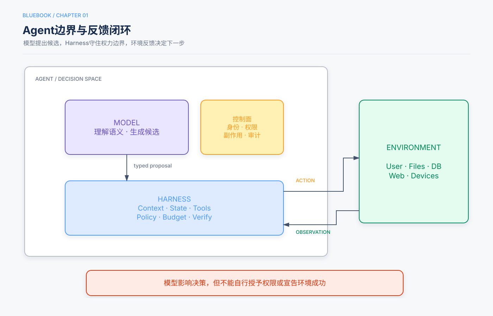

# 第1章　定义、边界与产业演进

> 状态：Release Candidate 1  
> 本章定位：建立全书唯一的Agent定义，并划清Model、Harness与Environment边界。

## 本章回答的三个问题

1. AI Agent与普通模型应用的本质区别是什么？
2. `LLM + 上下文 + 工具`如何形成闭环？
3. 为什么模型越强，Harness仍然重要？

## 5分钟速读

- Agent不是会聊天的模型，而是能够依据观察选择行动、获得环境反馈并持续推进目标的系统。
- `Agent = LLM + 上下文 + 工具`描述Agent边界内的实现组件；Environment位于边界之外。
- Model负责语义决策，Harness负责上下文、工具接口、状态、约束、验证和纠正。
- 许多产品能力提升来自观察空间和动作空间的扩展，而不只是替换更强模型。
- 生产系统必须把权限、状态、事实、预算和不可逆副作用留在确定性代码中。
- Harness不是对模型能力的否定，而是模型当前能力边界的工程补偿。

## 一、统一定义



AI Agent是：

> 能够依据当前上下文选择行动，通过受控工具与环境交互，并在预算和终止条件内持续推进目标的系统。

与普通生成应用相比，它多了三个要素：

- 模型需要在多个可能行动中作选择；
- 行动会读取或改变外部环境；
- 环境反馈会影响下一步，而不是一次生成后结束。

## 二、三种理解层次

| 层次 | 组成 | 解释 |
|---|---|---|
| 直觉 | 大脑 + 眼睛 + 手脚 | 思考、看见、行动 |
| 工程 | LLM + Context + Tools | 决策内核、当前信息、交互接口 |
| 控制 | Policy + Observation/History + Action Interface | 根据观察选择行动并接收反馈 |

这些映射用于建立直觉，不是严格等式。上下文只是当前观察和历史在模型侧的表示；工具背后的文件、数据库、网页和设备仍属于环境。

## 三、Agent与Environment

```text
Environment --观察--> Harness --上下文--> Model
Environment <--行动-- Harness <--候选决策-- Model
```

Environment包括：

- 用户和其他Agent；
- 文件、数据库和业务系统；
- 网页、浏览器和手机界面；
- 代码执行器与测试环境；
- 机器人、传感器和仿真世界。

Agent只能看到通过观察通道进入上下文的信息，也只能执行工具接口允许的动作。因此，能力建设经常是在重新设计观察空间和动作空间。

## 四、Model与Harness

### Model负责

- 理解自然语言目标；
- 处理歧义；
- 规划和候选分解；
- 选择工具与参数；
- 根据观察调整策略。

### Harness负责

- 构造每次调用的上下文；
- 暴露当前身份允许的工具；
- 校验模型输出；
- 维护状态与轨迹；
- 执行权限、预算和终止；
- 验证环境结果；
- 在失败时重试、恢复、改道或升级人工。

> **架构边界**  
> 模型可以建议“退款128元”，但订单是否存在、金额是否符合政策、用户是否有权、是否需要审批以及退款是否成功，都由Harness和环境系统判断。

## 五、观察空间与动作空间

### 5.1 观察不足

如果Agent不知道当前时间、用户权限、已有任务状态或工具失败原因，它会在错误信息上作出看似合理的判断。解决方案通常不是要求模型“更仔细”，而是把必要状态以可信形式提供给它。

### 5.2 动作不足

如果Agent只能生成文字，它不能真正完成查库、发信、改文件或运行测试。增加工具会扩展能力，也扩大风险；工具必须以最小权限和可验证结果为设计目标。

### 5.3 产品演进的共同轨迹

- 搜索Agent通过网页检索扩大观察空间；
- Coding Agent通过文件系统和执行器扩大观察与动作空间；
- Computer Use把GUI变为观察和行动接口；
- 语音和事件驱动系统扩展了交互模态与触发时机；
- 本地Agent把观察空间延伸到用户授权的设备和文件。

这些产品案例用于说明接口演进，不意味着所有系统都应拥有完整权限集合。

## 六、ReAct：最小闭环

```python
trajectory = [user_goal]

while budget.remaining():
    context = harness.build_context(trajectory)
    decision = model.decide(context)

    if decision.is_final:
        return harness.verify_completion(decision)

    call = harness.validate_and_authorize(decision.tool_call)
    observation = environment.execute(call)
    trajectory.extend([decision, observation])

return BudgetExhausted()
```

真实系统还必须处理并行调用、Checkpoint、审批、超时、取消和恢复。这个骨架只说明：模型选择行动，Harness校验，环境产生观察，循环由验证和预算终止。

## 七、Agent如何学习和变化

能力变化发生在三个时间尺度：

1. **任务内上下文适应**：证据和状态进入上下文，立即改变当前行为；
2. **跨任务外部产物更新**：知识、Prompt、Skill、程序和Harness被版本化更新；
3. **模型参数更新**：通过SFT、RL或蒸馏内化高维能力。

应优先选择最可审计、最容易验证的载体。能写成确定性规则的，不急于训练进参数；能通过检索提供的，不必永久塞进Prompt。

## 八、为什么Harness不会立即消失

模型会逐步内化工具调用、规划和自我纠错能力，但生产业务持续产生新的规则、权限、数据和风险。Harness的职责会变化，却不会因模型更强就自动消失：

- 模型今天做不稳的，Harness先补上；
- 模型内化一层后，Harness卸下一层启发式；
- Harness继续承担身份、授权、状态、审计和不可逆副作用控制。

这也是“方向上相信模型扩展，节奏上坚持工程验证”的含义。

## 九、常见失败模式

| 失败 | 根因 | 改进 |
|---|---|---|
| 有答案但未完成 | 把文本当作环境结果 | 独立完成验证器 |
| 重复调用工具 | 丢失历史或状态 | 类型化状态与轨迹 |
| 越权操作 | 模型决定授权 | 策略网关与最小权限 |
| 无限循环 | 无硬预算和终止 | 代码级预算、终态 |
| 幻觉事实 | 缺少权威观察 | RAG或实时查询 |
| 工具成功但业务失败 | 未验证最终状态 | 查询权威系统闭环 |

## 十、检查清单

- [ ] 系统是否真的需要根据环境反馈动态选择行动？
- [ ] Agent内部与Environment边界是否清楚？
- [ ] Model和Harness职责是否分离？
- [ ] 观察和行动接口是否最小充分？
- [ ] “完成”是否由环境事实验证？
- [ ] 权限、状态、预算和副作用是否由代码控制？

## 知识检查

1. 为什么Environment不属于`LLM + Context + Tools`公式内部？
2. 观察空间不足与模型能力不足如何区分？
3. Harness中哪些职责不应交给模型？
4. Agent能力变化的三个时间尺度分别是什么？

## 来源与证据

主要来源为主仓库引言和第1章、实验1-1，以及补充仓库Lesson 01和03。ReAct机制参考Yao等人的论文；实验边界以`chapter1/EXPERIMENT_LEDGER.md`为准。
