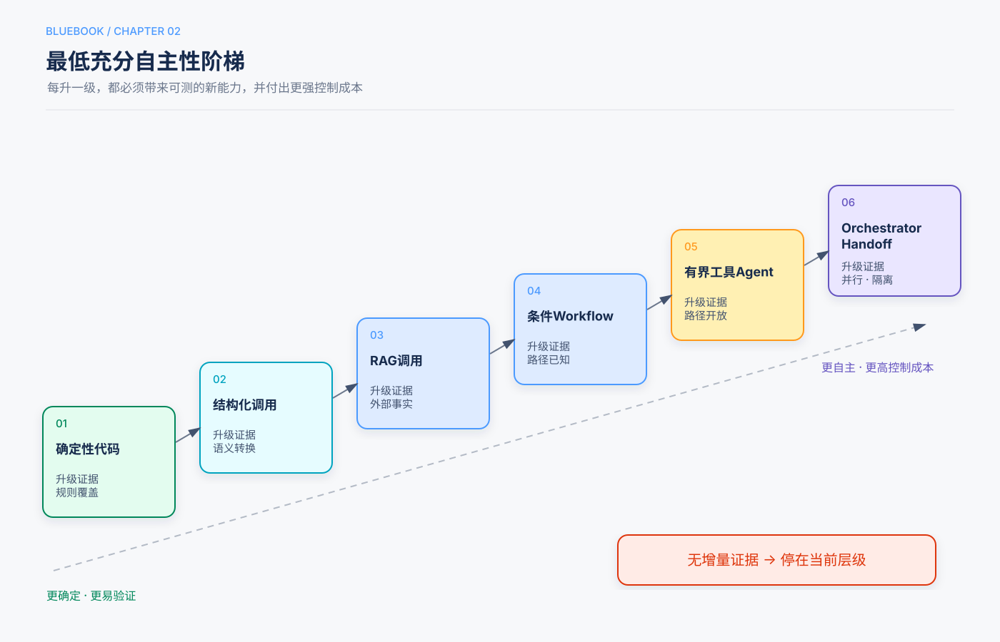

# 第2章　什么时候应该使用 Agent

> 状态：Release Candidate 1  
> 阅读路径：5分钟看决策序列；30分钟读模式矩阵；实施前填写章末 ADR。

## 本章回答的三个问题

1. 一个需求需要普通代码、一次模型调用、工作流，还是工具 Agent？
2. 什么时候才有理由继续升级为多 Agent？
3. 如何把“想用 Agent”转化为可复核的架构决定？

## 5分钟速读

### 决策序列

按顺序回答以下问题；只有当前层不能满足成功条件时才升级。

1. **确定性代码能否可靠解决？**
2. **一次带 Schema 的模型调用是否足够？**
3. **缺少的是外部或最新知识吗？** 增加检索。
4. **步骤稳定吗？** 使用固定工作流。
5. **任务类别明确吗？** 增加路由。
6. **子任务彼此独立吗？** 有界并行。
7. **显式反馈是否能稳定改善质量？** Evaluator–Optimizer。
8. **下一步无法预先确定，且工具反馈提供新信息吗？** 有界工具 Agent。
9. **未知子问题超出一个上下文并可独立工作吗？** Orchestrator–Workers。
10. **专家必须直接接管后续交互吗？** Handoff。

> **蓝皮书结论**  
> 采用 Agent 的理由不是“模型足够聪明”，而是任务确实需要模型根据环境反馈动态选择行动，并且这种自主性能够被验证和约束。

## 一、先定义问题合同

在讨论框架之前，先填写六项内容：

| 项目 | 要回答的问题 |
|---|---|
| Actor | 谁发起任务，谁承担结果？ |
| Goal | 要改变什么业务状态？ |
| Inputs | 哪些输入可信，哪些来自外部或用户？ |
| Outputs | 最终交付物或环境状态是什么？ |
| Success | 用什么独立证据判断成功？ |
| Impact | 错误会造成什么影响，能否撤销或补偿？ |

如果“成功”只能定义为“模型给出了一段令人满意的回答”，通常还不具备引入高自主性系统的条件。先建立可执行验证器或人工验收标准。

## 二、九类任务与默认架构

| 类型 | 识别信号 | 默认架构 |
|---|---|---|
| Transform | 一次有界输入到输出转换 | 单次结构化模型调用 |
| Pipeline | 子步骤稳定且有顺序 | Prompt Chain / Workflow |
| Route | 输入属于明确类别 | 确定性或模型辅助路由 |
| Parallel | 子任务独立、结果可合并 | 有界 Fan-out/Fan-in |
| Explore | 下一步依赖搜索或工具结果 | 有界工具 Agent |
| Refine | 明确反馈能改善候选结果 | Evaluator–Optimizer |
| Delegate | 未知独立子问题超过单一上下文 | Orchestrator–Workers |
| Converse | 专家必须接管持续对话 | Handoff |
| Long-running | 包含等待、审批、恢复或多阶段副作用 | 持久状态机/执行图 |

一个产品可能包含多种任务。例如理赔系统可以用路由识别类型，用RAG检索政策，用工作流核验材料，只在处理异常材料时启用探索型Agent。

## 三、自主性升级阶梯



### 3.1 确定性代码

适合：计算、格式校验、权限检查、状态转移、数据库查询和明确规则。

不要让模型决定：

- 用户是否有权限；
- 金额计算是否正确；
- 数据库当前事实；
- 是否已完成不可逆操作。

### 3.2 单次结构化调用

适合分类、抽取、总结、改写和候选方案生成。要求：

- JSON Schema/Pydantic/Zod契约；
- 语法、语义和业务规则分层校验；
- 空输出、拒答和截断分类处理；
- 不让输出直接触发高影响副作用。

### 3.3 检索增强调用

当失败来自知识缺失或时效性，而非缺少行动能力时，优先增加RAG。必须保留来源ID、信任标签和检索评估。

### 3.4 固定或条件工作流

步骤和分支大致已知时，用程序组织模型节点。每个节点有类型化输入输出和门禁，失败路径明确。

### 3.5 有界工具 Agent

只有在下一步必须根据真实环境结果动态决定时使用。最低控制包括：

- 工具白名单；
- 参数校验和授权；
- 最大轮数、Token、时间和费用；
- 明确终止状态；
- 独立完成验证器。

### 3.6 多 Agent

多 Agent 是隔离、并行和职责边界工具，不是“让系统更聪明”的快捷方式。需要通过本章后面的准入测试。

## 四、模式矩阵

| 模式 | 适用 | 避免 | 必要控制 |
|---|---|---|---|
| Single Structured Call | 有界转换 | 多个依赖决策 | Schema、语义校验 |
| RAG Call | 知识外部且变化 | 输入已完整权威 | 来源、信任、检索评估 |
| Prompt Chain | 稳定顺序分解 | 步骤动态 | 中间契约、门禁 |
| Router | 类别处理不同 | 类别高度重叠 | 路由评估、Fallback |
| Parallel | 子任务独立 | 共享可变状态 | 并发上限、合并契约 |
| Evaluator–Optimizer | 反馈标准明确 | 标准模糊或循环昂贵 | Rubric、最大轮数、增益测量 |
| Tool Agent | 动态步骤且有环境反馈 | 无反馈、无验证器 | 工具权限、预算、终止 |
| Orchestrator–Workers | 未知独立子问题 | 强耦合简单任务 | 上下文隔离、Artifact合并 |
| Handoff | 专家需直接接管交互 | 主控必须保留最终责任 | 上下文过滤、身份、移交审计 |
| Computer Use | 没有可用API | 存在稳定结构化接口 | 沙箱、域名/动作白名单、审批 |

## 五、四个关键选择

### 5.1 Planning还是固定计划

计划可以由模型生成，但必须被视为候选状态，而不是事实。环境变化或工具失败后应允许重规划。若任务步骤本就固定，模型规划只会增加变异和成本。

### 5.2 Evaluator–Optimizer还是自我检查

只有反馈引入独立信息时，迭代才更可信。例如：

- 代码测试结果；
- 页面渲染截图；
- 外部事实查询；
- 确定性业务规则；
- 经校准的人类或Judge Rubric。

让同一个模型重新阅读同一段文本，不自动构成有效验证。

### 5.3 Manager还是Handoff

使用Manager-as-tools，当：

- 最终答案需要一个责任主体；
- 专家只处理有界子任务；
- 用户应停留在一段对话；
- 主控需要合并冲突证据。

使用Handoff，当：

- 专家必须直接追问用户；
- 责任和策略确实转移；
- 后续交互高度专业化；
- 上下文可过滤且移交可审计。

### 5.4 API还是Computer Use

优先级通常是：

```text
稳定API → 受控浏览器/DOM工具 → 视觉Computer Use
```

GUI操作成本高、脆弱且更容易受到页面内容影响。只有没有结构化接口时，才把Computer Use作为动作通道，并为发送、支付、删除等操作增加人工确认。

## 六、多 Agent 准入测试

至少需要一个强理由：

- 独立并行研究可显著降低延迟或扩大覆盖；
- 独立上下文可避免污染或突破上下文容量；
- 不同身份和权限必须强制分离；
- 专家行为无法用Skill或工具以相同质量表达；
- Artifact所有权和异步委派是真实需求。

以下理由不成立：

- “不同角色更像一个团队”；
- “框架支持多 Agent”；
- “多个 Agent 应该比一个更聪明”；
- 一个Prompt可以完成，却为了架构图更复杂而拆分。

## 七、影响等级与人工控制

| 等级 | 示例 | 默认控制 |
|---|---|---|
| I0 | 生成草稿、只读分析 | 输出校验 |
| I1 | 读取内部文档、执行无副作用计算 | 最小权限、审计 |
| I2 | 可逆写入、创建草稿记录 | 幂等、预览、撤销 |
| I3 | 发邮件、提交表单、修改共享数据 | 明确批准、状态验证 |
| I4 | 支付、删除、生产部署、法律承诺 | 双重控制、准确载荷审批、补偿/回滚 |

影响越高，自主决策空间应越窄。模型可以起草 I4 动作，但不应自行授权。

## 八、架构决策记录（ADR）

每项Agent能力在实施前记录：

```yaml
task_class: Explore
selected_pattern: bounded_tool_agent
alternatives_rejected:
  deterministic_workflow: 下一步依赖未知搜索结果
  multi_agent: 子任务规模尚未超过单一上下文
success_validator: 最终报告引用覆盖率与事实核验
impact_level: I1
budgets:
  max_model_calls: 8
  max_tool_calls: 20
  wall_time_seconds: 180
controls:
  - read-only search tools
  - source allowlist
  - citation checker
rollback: no external writes
revisit_when: 单上下文评估连续失败或延迟SLO不达标
```

ADR的作用不是增加文档负担，而是防止系统在没有证据的情况下逐层增加自主性。

## 九、反例

### 反例A：发票字段抽取

字段已知、输出结构固定。使用一次结构化调用和确定性校验，而不是让Agent反复读取同一张发票。

### 反例B：固定退款流程

身份核验、政策检查、金额计算和审批步骤稳定。使用工作流；仅在材料异常时调用模型解释，不让Agent重新设计退款规则。

### 反例C：多Agent写同一摘要

多个同模型Agent读取同一材料再投票，没有新证据，只增加成本。除非独立检索不同来源或使用确定性事实验证，否则优先单调用或有界Evaluator。

### 反例D：浏览器操作已有API

若系统已有订单API，让Computer Use点击网页会降低稳定性、速度和可审计性。应优先API。

## 十、检查清单

- [ ] 问题合同已定义Actor、Goal、Inputs、Outputs、Success和Impact。
- [ ] 已说明为什么确定性代码不足。
- [ ] 已说明为什么单次调用或RAG不足。
- [ ] Agent每轮能获得新的环境反馈。
- [ ] 成功可由模型之外的证据验证。
- [ ] 工具权限与影响等级匹配。
- [ ] 预算和终止由代码强制。
- [ ] 高风险副作用可预览、批准、幂等和审计。
- [ ] 多Agent通过准入测试，并与单Agent基线比较。
- [ ] 触发重新评审的条件已写入ADR。

## 知识检查

1. 缺少最新知识时，为什么应先考虑RAG而不是Agent？
2. 什么条件使Evaluator–Optimizer循环真正有价值？
3. Manager与Handoff的责任边界有什么不同？
4. 为什么高影响任务通常应降低自主性？
5. 多Agent准入测试中，哪类理由与“角色更丰富”本质不同？

## 来源

本章综合主仓库第1、7、10章，以及补充仓库关于Agent入门、设计模式、Planning和多Agent的课程。架构选择顺序与模式控制要求记录在本蓝皮书规划和ADR中。
