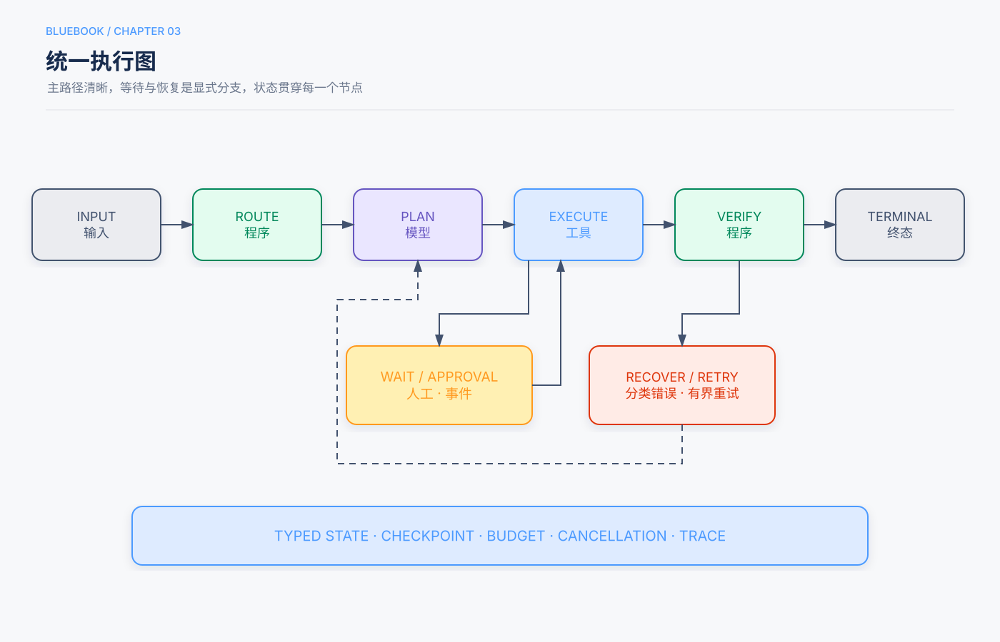

# 第3章　Agent Runtime与执行图

> 状态：初学者展开试稿，待人工审阅（基于Release Candidate 1修订）
>
> 本章定位：把模型调用、工具、状态、循环、停止和错误处理组织成一套能检查、能暂停、能恢复的运行机制。

## 本章回答的三个问题

1. 用户提出任务以后，模型调用和工具调用究竟是谁执行、怎样接起来的？
2. ReAct、工作流、Planning和多Agent，怎样放进同一张执行图？
3. 系统如何记住进度、判断完成，并在错误、超时或等待人工时安全退出？

前两章回答了“Agent是什么”和“什么时候值得使用”。这一章走进机器内部，看一次任务怎样真正跑起来。你不需要先会编程；本章的YAML和伪代码都只是结构示意，可以跳过语法，先读旁边的中文解释。

为了把零散概念串起来，本章沿用一个贯穿场景：学生请学校助手完成下面的任务。

> “帮我找一本适合初中生的月球科普书，确认本校图书馆现在能借，生成推荐卡。卡片先交给老师审批，批准后再发到班级群；不要替我预约。”

这个场景需要理解自然语言、查询资料、保存结果、等待审批和发送消息，恰好能说明`model`、`tool`、`state`、`loop`、`stop`和`error`。它是**教学示例**，不是某所学校的真实部署或实测报告。

## 5分钟速读

- **Agent Runtime（Agent运行时）**是负责推进一次Agent任务的程序：它调用模型、执行工具、读写状态、选择下一节点，并处理停止、错误、等待与恢复。
- **执行图**把运行过程画成“节点 + 边 + 状态”：节点做一件事，边决定下一步，状态携带已经核实的进度。
- **模型只提出候选决策。** 工具是否存在、参数是否合法、用户是否有权限、消息是否真的发送，都要由程序和外部系统确认。
- **状态不等于聊天记录。** 聊天记录保存说过什么；类型化状态明确记录任务处在哪一阶段、哪些事实已核实、还缺什么、预算剩多少。
- **循环必须有新反馈。** “观察 → 决策 → 校验执行 → 新观察”只有在获得信息或推进状态时才有意义；重复同一请求不是进展。
- **停止不只等于成功。** 成功、部分成功、阻塞、失败、取消和预算耗尽，都应是明确结果。
- **等待人工审批时应保存状态并释放进程。** 收到与当前运行匹配的事件后再恢复，不让模型一直空转。
- **本章讲的是设计方法，不报告新增实验。** “必须有预算”“副作用前后保存检查点”等是工程建议；具体阈值和收益要在自己的任务上实测。

## 一、先认识Runtime：谁把一次任务跑起来

### 1.1 Model、Tool和Runtime不是同一件事

**Model（模型）**在本章主要指大语言模型。它擅长理解“适合初中生”这样的语义要求，并根据当前资料提出下一步，例如“搜索月球主题书目”或“读取第二本书的简介”。模型API通常接收当前上下文，返回文本或结构化的工具调用请求。一次返回工具请求，并不表示工具已经执行。[^model-tool]

**Tool（工具）**是查询或改变外部环境的程序接口。`search_catalog`可以查书目，`get_availability`可以查馆藏，`send_class_message`可以发班级消息。工具背后的图书馆数据库和消息系统属于Environment（环境）；工具是访问它们的受控入口。

**Agent Runtime（Agent运行时）**是把这些部件接起来并推进任务的程序。你可以把它想成舞台监督：模型建议下一幕演什么，工具完成具体动作，Runtime负责核对顺序、递送材料、记录进度，并在该停的时候落幕。Runtime通常属于第1章所说的Harness运行与治理层。[^runtime]

在找书任务中，职责可以这样分：

| 事情 | 主要负责者 | 为什么不能混为一谈 |
|---|---|---|
| 判断简介是否偏入门 | Model提出判断 | 这是带有语义不确定性的任务，仍需展示依据 |
| 查询某书是否在馆 | Tool访问馆藏环境 | 实时状态不能靠模型记忆猜测 |
| 检查“只查询、不预约” | Runtime的策略检查 | 权限边界不能只依靠提示词 |
| 保存已核实书目与查询时间 | Runtime写入State | 下一轮和进程重启后都要继续使用 |
| 发出已批准的推荐卡 | Tool执行，消息系统返回结果 | 模型说“已发送”不等于外部系统接受 |

### 1.2 一轮模型调用和一轮任务运行不是一回事

一次**模型调用**是：Runtime组织输入，请求模型，拿到一个响应。一次**工具调用**是：Runtime校验模型提出的工具名称和参数，然后调用相应程序，拿到结果。一次完整的**运行（Run）**则可能包含多次模型调用、多次工具调用、程序校验和一次人工等待。

例如，第一轮模型提出搜索书目；工具返回三本候选。第二轮模型选择读取两本简介；工具返回内容。第三轮模型要求查询馆藏；工具发现第一本已借出。第四轮才转向第二本。这些轮次属于同一个`run_id`，即一次运行的唯一编号。

不同模型服务的消息字段并不完全相同，但共同机制是：模型提出请求，Runtime执行，再把结果放入后续上下文。原始书稿用API消息和`tool_call_id`完整展示了这种关联关系。[^model-tool]

### 1.3 最小循环：能跑不等于可生产使用

下面是教学伪代码，不对应某个SDK，也不能直接运行：

```text
建立任务状态

重复：
    Runtime根据状态准备本轮上下文
    proposal = 调用Model

    如果proposal请求工具：
        Runtime检查工具、参数、权限和预算
        result = 执行Tool
        把请求和结果写入状态
    否则：
        Runtime检查完成条件
        通过则结束；未通过则记录缺口并继续
```

它说明了最小机制，却还遗漏了超时、取消、恢复、防重复写入和并发冲突。Release Candidate中的执行图，就是为这些现实问题补上显式结构。

> **边界说明**
>
> 上述找书流程和代码是教学示例。后文的“本书建议”属于工程建议；本章没有重新调用模型，也没有测量某种Runtime能提高多少成功率、降低多少成本。具体框架、模型和阈值必须通过代表性任务验证。

## 二、统一执行图：把流程画成可检查的地图



### 2.1 Node、Edge、State和Terminal

**执行图（Execution Graph）**是描述任务如何流转的结构。它不是一定要使用某个“图框架”，也不要求界面真的画图；普通代码同样可以实现。四个基本词如下：

```text
Node（节点）：模型、工具、普通程序、人工审批或等待事件
Edge（边）：固定、条件、失败、重试或超时转移
State（状态）：节点之间传递的类型化事实、阶段和引用
Terminal（终态）：成功、部分成功、阻塞、失败、取消、预算耗尽
```

把它代入贯穿场景：`search_books`是工具节点，`judge_reading_level`是模型节点，二者之间的箭头是边；“已找到候选，但尚未核实馆藏”属于状态；“老师拒绝发布”可以进入阻塞或取消终态，而不是伪装成成功。

### 2.2 工作流和Agent都能画成图

工作流与Agent的差别不在于有没有图，而在于**哪些转移由程序预先规定，哪些行动由模型依据新观察提出**。[^graph]

固定部分可以是：只有书目和馆藏都通过校验，才能生成推荐卡；没有老师批准，发送节点绝不能运行。动态部分可以是：候选书已借出后，模型选择查询哪一本替代书，或资料不足时选择查哪类来源。

因此，一张图可以同时包含确定性工作流和有界Agent循环。稳定业务规则包住模型的灵活判断，比把所有事情都交给模型更容易检查。

### 2.3 一次找书运行的简化图

```text
接收请求
  → 程序检查任务边界
  → 模型选择下一项查询
  → 程序校验工具请求
  → 工具查询并返回观察
  → 更新状态
  ↘ 证据不足：回到“模型选择下一项查询”
  ↘ 证据齐全：生成推荐卡
  → 程序校验卡片字段
  → 等待老师审批
  ↘ 拒绝：阻塞/结束
  ↘ 批准：发送消息 → 查询发送状态 → 成功/失败
```

注意，等待审批不是模型节点，发送后的确认也不是让模型猜。图的价值在于把这些责任和失败出口显式画出来。

## 三、State：给任务一本结构化进度册

### 3.1 状态、上下文、轨迹和Artifact的区别

这些词容易混淆：

- **State（状态）**：Runtime维护的结构化运行事实，例如阶段、预算、已核实候选和错误。
- **Context（上下文）**：某一次调用模型时实际提供的资料；它通常由状态的一部分、相关历史和工具说明组成。
- **Trajectory（轨迹）**：按时间记录用户消息、模型响应、工具请求与结果等事件。
- **Artifact（产物）**：单独保存的大对象，例如完整网页、PDF、推荐卡文件或测试报告；状态里只放它的引用。

状态像进度册，轨迹像流水账，Artifact像资料柜，上下文则是这一轮摆到模型桌面上的材料。四者有关联，但不应只用一长串聊天消息代替全部。类型化状态和显式终态有助于恢复、测试和审计，这是蓝皮书P04模式卡的设计主张。[^state]

### 3.2 最小状态Schema

**Schema**是字段、类型和约束的约定，可以理解为一张规定了栏目和填写方式的表。下面的YAML仅用于教学，其中数值是示例预算，不是推荐阈值：

```yaml
run_id: run_123
status: running
objective: 找到适合且可借的月球科普书，并生成待审批推荐卡
current_node: verify_availability
facts:
  - book_id: BK-204
    title: 月球入门（教学假名）
    reading_level: beginner
    availability: available
    observed_at: 2026-09-21T10:05:00Z
artifacts:
  - kind: recommendation_card
    uri: artifact://run_123/card-v1.md
errors: []
approvals: []
budget:
  model_calls_remaining: 3
  tool_calls_remaining: 8
  deadline: 2026-09-21T12:00:00Z
versions:
  graph: 3
  prompt: book-research-v5
  toolset: library-readonly-v2
```

`月球入门`、编号和时间都是格式示意，不代表真实书目或馆藏。`versions`记录图、提示词和工具集版本，使问题发生后能够知道当时运行的究竟是哪套配置。

### 3.3 什么可以进入权威状态

本书建议区分三类内容：

1. **已核实事实**：工具返回的书目编号、馆藏状态和查询时间，同时保留来源。
2. **候选判断或假设**：模型认为“适合入门”，应标明依据和置信边界，不能伪装成图书馆事实。
3. **执行意图**：准备发送某版卡片，不等于已经发送。

计划中的“将查找三份资料”也是任务结构，不是“已经找到三份资料”。把计划、候选判断和权威事实混在一个`facts`列表里，会产生计划幻觉：后续节点把“打算做”误读为“已经做”。

大型网页、代码和日志不宜全部塞进状态。把它们存入Artifact Store（产物存储），状态中保存地址、摘要、来源和内容校验值；需要时由节点按权限读取。这样既减小状态，也避免每轮把全部资料重新交给模型。

### 3.4 Checkpoint：任务的存档点

**Checkpoint（检查点）**是可持久保存的状态快照，类似游戏存档。进程重启后，Runtime从最近一个可信检查点恢复，而不是从聊天开头猜测进度。蓝皮书P05建议在副作用前后、进入等待前和重规划前保存版本化检查点。[^checkpoint]

对于发送班级消息，可以这样记录：

```text
保存：准备发送的精确卡片版本 + 收件范围 + 审批记录
→ 执行发送
→ 查询消息系统的权威状态
→ 保存：已发送的外部消息ID和时间
```

只保存“模型说发送完成”没有恢复价值。真正需要的是外部系统能够核对的标识和结果。

## 四、从状态图看五种基础模式

这些模式不是必须全部使用的积木。第2章的最低充分自主性原则仍然有效：任务已经能由简单流程完成，就不要为了画一张复杂图增加节点。[^minimum]

### 4.1 Prompt Chain：已知步骤按顺序走

**Prompt Chain（提示链）**把若干模型或程序步骤串联起来：

```text
抽取需求 → 检索证据 → 生成草稿 → 格式校验
```

在找书场景里，如果候选书已经由老师给定，程序只需查询馆藏、生成卡片并校验，步骤稳定，固定链就可能够用。每个节点应有输入输出Schema；上一步缺少书目编号，不能把无效结果悄悄传给发送节点。

### 4.2 Router：把请求送到正确路径

**Router（路由器）**像服务台分流：

```text
请求 → 确定性规则 → 必要时模型辅助分类 → 专用流程 / Fallback
```

`Fallback`是兜底路径，例如无法判断用户是查询还是预约时，先追问而不是猜。规则能识别“不要预约”，就先用规则限制动作；模型辅助理解自由文本，但不能覆盖程序设定的权限。

路由器本身也会错。要测试边界请求、混合请求和错路由的后果，而不是只看最清楚的样例。

### 4.3 Fan-out/Fan-in：独立任务并行后合并

**Fan-out/Fan-in（扇出/汇入）**先把任务分给多个独立分支，再统一合并：

```text
候选书目 → [读取A简介, 读取B简介, 读取C简介]
         → 结构化合并 → 冲突检查
```

只有相互不依赖的任务才适合并行。若B的查询参数必须由A的结果产生，就必须串行。并行分支不要共同修改同一份推荐卡；每个Worker写私有结果，由合并节点按契约整合。还要定义并发上限、超时、部分失败和排序规则。

这不等于多Agent。普通程序并发执行三个工具调用，也属于并行。

### 4.4 Evaluator–Optimizer：根据新证据修订

**Evaluator–Optimizer（评价者—优化者）**让一个步骤生成候选，另一个步骤指出缺口，再修复：

```text
生成候选 → 获取独立证据 → 评价缺口 → 修复 → 再验证
```

有效证据可以是馆藏查询、格式校验、程序测试、页面渲染或明确业务规则。如果“评价者”只是同一个模型重读同一段文字并说“可以更好”，它没有获得新的事实，可信度有限。评价者也可能是程序或人，不必包装成另一个Agent。[^evaluator]

循环必须有限：规定最大轮数、每轮应修复的具体缺口，以及连续没有改善时的出口。

### 4.5 Tool Loop：下一步要看新观察

当无法预先知道下一本该查什么时，使用工具循环：

```text
观察 → Model提出行动 → Runtime校验并执行Tool
     → 新观察 → 继续 / 停止
```

找书助手发现第一本已借出，于是查询第二本；发现简介没有标出阅读难度，于是查可靠介绍。这正是循环有价值的地方：环境反馈改变了下一步。

Runtime要强制工具白名单、参数与权限校验、时间和调用预算、重复检测与完成验证。只在提示词中写“不要无限循环”，不是可执行的上限。[^bounded-loop]

## 五、贯穿一次完整运行：Model、Tool、State、Loop、Stop、Error

### 5.1 启动：先建立边界和初始状态

Runtime收到用户请求后，创建`run_id`，记录目标、“不预约”的限制、可用工具和预算。这里先做确定性检查：任务是否缺少学校身份，查询工具是否可用，发送班级群是否需要老师批准。

模型可以帮助提取“月球主题、初中水平”，但Runtime应把“不预约”和“发送前审批”固化为执行策略，而不是只留在一段可能被后续内容淹没的提示词里。

### 5.2 Model：提出下一步，不直接改现实

Runtime将目标、当前进度、相关工具说明和剩余预算组织成上下文。模型可能返回：

```json
{
  "action": "search_catalog",
  "arguments": {"topic": "月球", "audience": "初中生"}
}
```

这是**候选工具请求**。Runtime仍要检查：工具是否在白名单；参数是否符合Schema；当前身份是否允许查询；预算是否足够。若模型提出`reserve_book`，程序应拒绝，因为用户明确禁止预约。

### 5.3 Tool：执行后返回观察，也可能返回错误

`search_catalog`执行后可以返回候选书目。Runtime把每个工具结果与调用编号关联，避免把A书的结果误配给B书。接着，模型根据候选选择查询简介与馆藏。

工具结果可能是：成功且有结果、成功但无匹配、临时超时、参数错误、权限拒绝。**空结果不是错误，错误也不是“没有这本书”。** Runtime必须保留结构化区别，模型才能选择正确下一步。

### 5.4 State：只提交经过验证的进度

当馆藏工具返回“BK-204当前可借”，Runtime记录书目编号、状态、查询时点和来源。模型对阅读难度的判断则记录为候选判断，并附简介证据。推荐卡作为Artifact保存，状态只引用其版本。

“提交进度”不是Git提交，而是把已验证信息写入持久状态。验证失败的候选可以保留在轨迹和错误记录中，但不能升级为已完成事实。

### 5.5 Loop：每一轮都要问“有什么变化”

Runtime可以用以下信号判断循环是否有进展：

- 新增了一条与目标相关的观察；
- 一个未完成条件变成已满足；
- 错误原因改变，并产生了可验证的新尝试；
- 生成或更新了可检查的Artifact；
- 进入等待用户或审批的明确状态。

反复调用同一工具、使用同一参数、得到同一错误，并不算进展。若最近若干轮的关键状态摘要完全相同，应停止自动重试或换路径；具体“若干轮”必须按任务实测设定，本章不提供万能数字。

### 5.6 Stop：模型可以建议结束，Runtime决定终态

模型可能返回“资料已齐全，可以生成推荐”。Runtime要检查完成条件：

- 有唯一书目编号；
- 主题和适读判断有对应依据；
- 当前可借状态来自馆藏查询并带时点；
- 推荐卡字段完整；
- 没有发生预约；
- 若要发送，存在针对精确卡片版本和收件范围的批准；
- 消息系统确认最终状态。

只有相应检查通过，才进入成功。模型没有再请求工具，只表示它停止生成工具请求，**不自动等于任务成功**。

### 5.7 Error：把失败变成可处理的状态

假设馆藏工具超时。Runtime先记录工具、参数摘要、错误类别、尝试次数和时间。若错误被标记为可重试且仍有预算，可以按策略重试；若持续失败，则进入阻塞或失败，并告诉用户“无法确认当前馆藏”。不能拿模型记忆补成“可借”。

再假设发送请求超时。这里更危险：消息也许已经发出，只是回执丢失。直接重试可能发两次。Runtime应先使用稳定的**幂等键（Idempotency Key）**查询原请求或权威消息状态；幂等键用于让系统识别“这是同一业务动作的重试”。幂等不等于撤销，已经发送的消息也不会因此消失。[^idempotency]

## 六、Planning与Replanning：计划是待办结构，不是事实清单

### 6.1 Planning解决什么问题

**Planning（规划）**把模糊目标拆成可追踪子任务。一个计划应结构化，说明依赖和完成条件，而不是写一篇充满承诺的散文。

```yaml
steps:
  - id: collect_candidates
    depends_on: []
    success: candidates_have_catalog_ids
  - id: verify_candidates
    depends_on: [collect_candidates]
    success: reading_basis_and_current_availability_recorded
  - id: draft_card
    depends_on: [verify_candidates]
    success: required_fields_present
  - id: await_approval
    depends_on: [draft_card]
    success: exact_card_version_approved
  - id: publish
    depends_on: [await_approval]
    success: authoritative_message_status_is_sent
```

计划里写的是“收集候选”，不是“已有三本权威书目”；写的是“等待批准”，不是“老师将会批准”。未知事实可以作为待验证假设，但要明确标记。

### 6.2 Replanning何时发生

**Replanning（重规划）**是根据新信息调整剩余路径。例如第一候选已借出，系统换查第二候选；老师拒绝卡片并指出“缺少查询日期”，系统回到修订节点。

重规划不能改写已经发生的历史，也不能为了方便而删除审批条件。它改变的是实现目标的候选路径，不是用户边界、权限和成功定义。

### 6.3 何时不需要单独规划节点

两三步固定任务没有必要先花一次模型调用生成计划。计划的价值在于暴露依赖、协调长任务或支持恢复；如果步骤已由程序清楚定义，直接执行工作流更简单。

Planning本身也要消耗时间和费用，而且模型计划可能错误。是否增加规划节点，应与无规划的简单基线比较，而不是默认“先规划总会更好”。

## 七、Loop Engineering：怎样让循环有效且有界

### 7.1 一个可靠循环的五步

原始书稿把Loop Engineering概括为发现工作、执行、验证和记录进度。本章将它展开为：[^loop]

```text
发现下一项有界工作
→ 执行
→ 用独立证据验证
→ 提交已验证进度
→ 判断继续、等待或进入终态
```

“有界工作”意味着这一轮交付物明确，例如“核实BK-204馆藏”，而不是“继续研究直到完美”。验证器是能根据规则或外部证据检查结果的程序、工具或人工步骤。

### 7.2 硬预算由程序执行

循环至少可以限制：模型调用次数、工具调用次数、总时间、费用或Token、并发数和子任务数。预算是**硬边界**时，必须由Runtime扣减和拒绝超额请求；把剩余预算展示给模型可以帮助它调整策略，但不能代替程序计数。

预算不是越大越好，也没有一套适合所有任务的数字。预算过紧会提前终止，过松会扩大最坏成本。先用代表任务记录分布，再依据服务目标设定，并保留预算耗尽的诚实终态。

### 7.3 完成验证应匹配任务性质

程序可以精确检查书目编号、卡片字段和消息状态；“这本书是否适合某位学生”则包含主观判断。此时可以展示简介和判断理由，让老师确认，而不是伪造一个百分之百客观的自动验证器。

独立验证的含义是证据不只来自候选输出自身。另一个模型如果读取同一段错误内容，也可能一起判断错误。对于事实主张，应尽量连接权威查询；对于程序，运行测试；对于页面，检查实际渲染；对于主观质量，使用清楚的分项标准与人工判断。

### 7.4 取消要在安全点生效

用户可能在任务中途取消。Runtime应记录取消请求，阻止新的高影响动作，并在**安全点**退出。安全点是不会留下不一致中间状态的位置，例如工具调用结束、事务完成或检查点已保存之后。

不能简单杀掉正在发送请求的进程，再假定什么都没发生。对于可能已产生副作用的动作，要先查权威状态，再决定补偿或报告。

## 八、人工、事件和长任务：等待不是空转

### 8.1 为什么等待审批不应占住进程

推荐卡生成后，老师可能第二天才审批。让一个线程持续运行，或让模型每分钟问“批准了吗”，都会浪费资源，也无法保证进程不重启。

Runtime应保存检查点，把状态设为`waiting_for_approval`，登记期待的事件，然后释放计算资源。老师操作后，审批系统发出事件，Runtime加载状态并从相应节点恢复。这是一种**持久状态机**：任务阶段保存在持久存储中，不依赖某个进程一直活着。[^events]

### 8.2 事件怎样匹配正确运行

审批、Webhook（外部系统主动发来的网络回调）、定时器和后台任务完成通知，都属于事件。事件至少应绑定：

- `run_id`：唤醒哪次运行；
- 期待的事件类型：这是审批还是工具完成；
- 对象与版本：批准的是哪一版卡片；
- 发送者身份或来源；
- 过期时间和防重复标识。

否则，旧卡片的批准可能误唤醒新卡片，另一次任务的Webhook也可能串入当前运行。事件内容仍是不可信输入，要先验证身份、签名、时效和Schema。

### 8.3 Waiting、Blocked和Terminal不是一回事

`waiting`表示系统知道在等什么事件，到达后可以继续；`blocked`表示缺少权限、资料或人工决定，目前没有自动继续路径。团队可以把两者建模为非终态，也可以让“阻塞”成为本次运行的终态并由新运行接续，关键是语义要明确。

不要只用`status: stopped`。它无法回答：成功了吗？用户取消了吗？还在等老师吗？将来还能恢复吗？

## 九、错误、重试、恢复与补偿

### 9.1 每个节点都要有失败合同

节点不仅要说明正常输入输出，还应定义：

- 输入Schema和输出Schema；
- 超时；
- 哪些错误可重试；
- 最大尝试次数；
- 重试前是否要查权威状态；
- 是否存在补偿操作；
- 最终失败走向哪里。

**错误合同**不是说错误一定会发生，而是提前约定发生后怎样分类和处理。

### 9.2 不是所有错误都应重试

临时网络中断可能适合重试；参数格式错误通常应先修正；权限拒绝不应靠反复请求突破；“无匹配书目”是合法业务结果，不是网络错误。

可以把常见错误粗分为：

| 类别 | 示例 | 典型处理方向 |
|---|---|---|
| 临时故障 | 服务短暂不可用 | 有上限退避重试；仍需预算 |
| 永久输入错误 | 缺少必填书目编号 | 修正或向用户澄清 |
| 权限或政策拒绝 | 尝试预约 | 不重试；记录并换合法路径 |
| 不确定副作用结果 | 发送超时 | 先查幂等记录或权威状态 |
| 合法空结果 | 没有符合条件的书 | 改变查询或诚实结束 |
| 验证失败 | 卡片缺少查询时间 | 返回修订节点，限制轮数 |

### 9.3 幂等、回滚和补偿不同

**幂等**防止同一业务请求重复生效。**回滚**把系统恢复到先前状态，常见于尚未提交的数据库事务。**补偿**是在无法真正撤销时做后续修正，例如发一条更正消息。

发出的班级消息可能已被阅读，不能真正“回滚到无人看见”；删除唯一文件也可能无法恢复。因此，工程设计应在副作用发生前尽量预览、审批和保存恢复材料，而不是把希望都寄托在事后补偿。

### 9.4 恢复时不能重放全部轨迹

进程重启后，如果从头机械重放所有工具请求，可能重复发送消息。恢复应读取检查点，核对外部副作用状态，从尚未确认完成的节点继续。副作用前后的检查点与幂等键要配套使用。[^checkpoint][^idempotency]

## 十、Orchestrator、Worker与Handoff

### 10.1 Orchestrator–Workers：动态拆分后收回结果

**Orchestrator（编排者）**负责拆分、分配预算和合并结果；**Worker（执行者）**处理有界子任务。若系统运行时才发现要核对哪些书或来源，且它们彼此独立，可以使用这种模式。

Worker应返回结构化结果、来源和Artifact引用，而不是把全部内部轨迹一股脑塞给编排者。编排者仍要处理冲突：两个来源对阅读难度判断不同，应显式保留分歧，不能任意选一个。

如果一开始就知道要读三份简介，普通并发工具调用可能更简单，不必创建三个自主Agent。

### 10.2 Handoff：把后续交互交给另一处理者

**Handoff（移交）**是把接下来的对话或任务责任转给另一Agent或专门流程。例如学生的请求变成“补办借书证”，账户恢复流程可能需要直接接手后续身份核验。

移交时要明确：接收者是谁、接手什么、获得哪些最小必要上下文、使用什么身份和工具、怎样转回或升级人工。角色名称不能产生权限；Runtime仍然控制真实凭据和政策。

### 10.3 Skill不是Subagent

**Skill**在本书中指可按需加载的任务知识和操作说明；**Subagent（子Agent）**则有独立上下文、生命周期或任务所有权。若差异只在知识、流程或写作风格，优先加载Skill；只有确实需要独立上下文、权限、生命周期或并行责任时，才创建Subagent。[^multi-agent]

这延续第2章的准入原则：新增一个Agent必须说明它解决什么具体问题，并与更简单方案比较。

## 十一、反例：这些图“能跑”，却不可靠

### 11.1 反例一：把模型的`done`直接映射为成功

```text
模型无工具调用 → success
```

模型可能因为忘记任务、上下文截断或服务限制而停止调用工具。正确做法是进入完成验证节点；证据不足时返回缺口、阻塞或失败。

### 11.2 反例二：工具超时就立即重试发送

```text
send_message超时 → 再发一次 → 再超时 → 再发一次
```

超时不说明第一次没有发生。应绑定稳定幂等键，查询消息系统状态，再决定重试。否则一条推荐可能被发多次。

### 11.3 反例三：三个Worker直接编辑同一文件

```text
Worker A ─┐
Worker B ─┼→ 同一个card.md
Worker C ─┘
```

后写入者可能覆盖前者，最终文件甚至混合半截内容。每个Worker应写私有产物，合并节点按明确契约生成新版本。

### 11.4 反例四：Reviewer只说“我同意”

生成模型和评审模型都只看同一份草稿，没有馆藏记录或简介来源。两个模型一致，仍不能证明书在馆。Reviewer应读取独立证据，并指出哪条要求通过或失败。

### 11.5 反例五：等待老师时让模型不断轮询

模型每隔一分钟询问审批状态，既消耗预算，也可能在长时间等待中丢失状态。应持久化为`waiting`，由审批事件唤醒；若外部系统只能轮询，也应由普通定时任务按策略查询，不必每次调用模型。

### 11.6 反例六：错误全塞进一个字符串

`errors: ["failed"]`无法判断哪个节点、哪次尝试、是否可重试。结构化错误至少应包含节点、类别、时间、调用标识和安全的诊断摘要；敏感参数不能未经处理写入日志。

## 十二、执行图设计检查清单

可以拿贯穿场景或自己的系统逐项检查：

- [ ] **运行边界清楚。** 一次Run从哪里开始，怎样编号，谁可以取消？
- [ ] **节点职责单一。** 模型处理语义判断；程序处理权限、预算、精确计算和强制转移。
- [ ] **输入输出类型化。** 缺字段、空结果、拒绝和超时不会被混为成功。
- [ ] **状态与轨迹分开。** 聊天历史不是唯一业务状态来源。
- [ ] **大型Artifact分离。** 状态保存引用、来源和版本，不反复搬运全文。
- [ ] **计划不冒充事实。** 假设、意图、候选判断和已核实事实可区分。
- [ ] **每个循环有反馈。** 能说明本轮新增了什么证据或状态变化。
- [ ] **硬预算由Runtime执行。** 模型不能自行延长时间、费用或调用次数。
- [ ] **完成有验证器。** 没有工具请求或模型自称完成，不直接等于成功。
- [ ] **所有出口语义明确。** 成功、部分成功、等待、阻塞、失败、取消和预算耗尽不会混淆。
- [ ] **并行任务真正独立。** 有并发上限、私有工作区和合并契约。
- [ ] **Reviewer读取独立证据。** 不是只换一个角色重复评价。
- [ ] **等待可以持久恢复。** 事件绑定运行、对象版本、身份和过期时间。
- [ ] **副作用可核对。** 审批绑定精确载荷，超时先查状态，重试使用稳定幂等键。
- [ ] **恢复不会重放副作用。** 检查点记录已经发生且已确认的动作。
- [ ] **配置可追踪。** 图、Prompt、Schema、模型和工具集版本进入运行记录。

## 知识检查

先用自己的话回答，再看参考解释。

1. 模型返回`send_class_message`工具调用时，消息是否已经发送？
2. 为什么聊天记录不能完全代替类型化State？
3. 工作流和Agent都能表示为执行图，它们的主要差别是什么？
4. 模型没有继续请求工具，为什么Runtime仍不能直接标记成功？
5. 馆藏查询连续两次超时，第三次是否一定应该重试？
6. 老师审批要等一天，为什么应进入`waiting`而不是让进程一直运行？
7. 三个Worker并行读取三份简介时，怎样避免它们覆盖同一推荐卡？
8. 计划写着“找到三份权威来源”，为什么不能把它直接存为已核实事实？
9. Skill和Subagent的选择依据是什么？

### 参考解释

**第1题：没有。** 模型只提出候选请求。Runtime还要检查工具、参数、权限与审批，再由工具执行，并根据消息系统的结果确认状态。

**第2题：聊天记录是事件流水，难以稳定表达权威事实、阶段、预算和终态。** 类型化State让字段含义、来源和转换可以检查，也便于进程重启后恢复。

**第3题：关键在转移由谁决定。** 工作流的主要边与条件由程序预先规定；Agent会在允许范围内根据新观察提出部分行动。两者可以混合在同一图中。

**第4题：停止生成可能来自忘记、截断或失败。** Runtime必须对照完成条件和独立证据；不满足时应记录缺口或进入非成功终态。

**第5题：不一定。** 要看错误是否临时、预算是否足够、重试是否有新条件，以及任务时限。对于会产生副作用的工具，还要先查询权威状态。

**第6题：等待时间远长于一次计算，而且进程可能重启。** 保存状态、释放资源并由绑定当前Run的审批事件恢复，更节省资源也更可靠。

**第7题：让每个Worker输出私有的结构化结果或Artifact。** 再由单独的合并节点生成新卡片版本，并处理冲突。

**第8题：它描述的是目标或待办，不是已经发生的事实。** 只有查询结果及其来源通过验证后，才能提交为已核实进度。

**第9题：只有知识和流程差异时优先Skill。** 需要独立上下文、权限、生命周期、并行工作或任务所有权时，才评估Subagent，并与简单基线比较。

## 本章小结

回到找书任务：Runtime先建立目标、边界和预算；Model根据当前上下文提出查询；Runtime校验后执行Tool；Tool返回的观察进入轨迹，经过验证的事实写入State；循环根据新反馈继续。资料齐全后，程序验证推荐卡，保存检查点并等待老师审批。批准事件到达后，Runtime恢复运行，执行发送并查询权威结果。任何一步都可以进入失败、阻塞、取消或预算耗尽，而不是只有“成功”一个出口。

统一执行图的意义，不是把简单任务画复杂，而是让每个重要问题有明确位置：**谁作出候选判断，谁允许执行，事实存在哪里，错误往哪里走，凭什么停止，又怎样恢复。**

只要记住一条主线即可：**模型负责语义上的候选下一步；Runtime负责把候选行动变成受控、可验证、可恢复的执行。** 下一章将进一步讨论，Runtime在每一轮应该怎样选择和组织模型看到的上下文。

## 来源与证据

本章保留Release Candidate 1的核心主线、统一执行图、最小状态Schema和基础模式，并按前两章风格作初学者展开。本章没有新增或复现实验，不提供框架性能、成功率、成本或最佳阈值的实测结论。贯穿场景、Schema值和伪代码均为教学示例；模式卡中的做法以工程建议呈现。以下仓库链接固定到本次修改前的提交`0ec573effbf546d03e3776ce78432a28b7a3e0e8`，外部论文链接用于核对概念来源。

[^model-tool]: 原始中文书稿[第2章“带工具调用的多轮交互”](https://github.com/manmonthW/ai-agent-book/blob/0ec573effbf546d03e3776ce78432a28b7a3e0e8/book/chapter2.md)完整展示模型API返回工具请求、Agent框架执行工具、用调用ID关联结果并再次调用模型的过程；[原始第1章](https://github.com/manmonthW/ai-agent-book/blob/0ec573effbf546d03e3776ce78432a28b7a3e0e8/book/chapter1.md)给出Model–Harness–Environment边界。本章抽取共同机制，不声称各厂商字段完全一致。

[^runtime]: [本章修订前版本](https://github.com/manmonthW/ai-agent-book/blob/0ec573effbf546d03e3776ce78432a28b7a3e0e8/bluebook/chapters/03-agent-runtime.md)将Runtime表达为执行状态图的运行层；蓝皮书[P02模型与程序职责分离](https://github.com/manmonthW/ai-agent-book/blob/0ec573effbf546d03e3776ce78432a28b7a3e0e8/bluebook/patterns/P02-model-program-separation.md)要求模型产生类型化提议，程序负责策略、验证和环境执行。这是本书的工程边界，不是所有软件框架必须采用的唯一术语划分。

[^graph]: 原始中文书稿[第1章“Graph工程”](https://github.com/manmonthW/ai-agent-book/blob/0ec573effbf546d03e3776ce78432a28b7a3e0e8/book/chapter1.md)与[第10章“协作拓扑”](https://github.com/manmonthW/ai-agent-book/blob/0ec573effbf546d03e3776ce78432a28b7a3e0e8/book/chapter10.md)讨论节点、边和结构化状态。本章将“工作流与Agent都可表示为图”作为统一建模视角，不把“Graph Engineering”名称的流行时间或产品实现当作本章结论所必需的证据。

[^state]: 蓝皮书[P04类型化状态与显式终态](https://github.com/manmonthW/ai-agent-book/blob/0ec573effbf546d03e3776ce78432a28b7a3e0e8/bluebook/patterns/P04-typed-state.md)主张使用版本化State Schema，并区分成功、部分成功、阻塞、失败、取消和预算耗尽；原始中文书稿[第3章“记忆的层次结构”](https://github.com/manmonthW/ai-agent-book/blob/0ec573effbf546d03e3776ce78432a28b7a3e0e8/book/chapter3.md)区分轨迹、长期记忆和业务状态。

[^checkpoint]: 蓝皮书[P05 Checkpoint与持久恢复](https://github.com/manmonthW/ai-agent-book/blob/0ec573effbf546d03e3776ce78432a28b7a3e0e8/bluebook/patterns/P05-checkpoint-recovery.md)建议在副作用前后、等待前和重规划前保存版本化检查点，并明确指出只保存聊天或不记录已完成副作用的失败模式。本章据此给出教学流程，未对某种存储实现做性能测试。

[^minimum]: 蓝皮书[ADR-003](https://github.com/manmonthW/ai-agent-book/blob/0ec573effbf546d03e3776ce78432a28b7a3e0e8/bluebook/plan/DECISIONS.md)和[P01最低充分自主性](https://github.com/manmonthW/ai-agent-book/blob/0ec573effbf546d03e3776ce78432a28b7a3e0e8/bluebook/patterns/P01-minimum-sufficient-autonomy.md)。这是一项架构选择原则，不是经本章实验验证的普遍最优定律。

[^evaluator]: 原始中文书稿[第10章“提议者—审核者循环”](https://github.com/manmonthW/ai-agent-book/blob/0ec573effbf546d03e3776ce78432a28b7a3e0e8/book/chapter10.md)强调审核者应读取独立证据，而不是只复述提议者解释。本章将其扩展到程序测试、馆藏查询和人工标准；不声称增加第二个模型本身必然提高质量。

[^bounded-loop]: 蓝皮书[P03有界执行循环](https://github.com/manmonthW/ai-agent-book/blob/0ec573effbf546d03e3776ce78432a28b7a3e0e8/bluebook/patterns/P03-bounded-loop.md)定义`Observe → Decide → Act → Verify`，并要求Runtime强制步骤、时间、费用和无进展上限。ReAct研究来源为Yao等，[ReAct: Synergizing Reasoning and Acting in Language Models](https://arxiv.org/abs/2210.03629)；本章工程循环加入了权限、预算和终态，不应视为论文算法的逐字实现。

[^loop]: 原始中文书稿[第10章“Loop工程”](https://github.com/manmonthW/ai-agent-book/blob/0ec573effbf546d03e3776ce78432a28b7a3e0e8/book/chapter10.md)讨论发现工作、执行、验证和记录进度，并明确“模型可以提出完成，但不能批准自己的完成”。原稿还包含具体框架与基准数字；本章只采用机制，不转述未在本次任务中独立复核的效果数字。

[^events]: 原始中文书稿[第6章“异步与事件驱动”](https://github.com/manmonthW/ai-agent-book/blob/0ec573effbf546d03e3776ce78432a28b7a3e0e8/book/chapter6.md)讨论事件队列、任务句柄、定时器、Webhook及工具完成事件；[本章修订前版本](https://github.com/manmonthW/ai-agent-book/blob/0ec573effbf546d03e3776ce78432a28b7a3e0e8/bluebook/chapters/03-agent-runtime.md)要求以`blocked/waiting`持久化并按`run_id`、期待类型和过期时间恢复。本章不沿用原稿中的时效性产品能力判断。

[^idempotency]: 蓝皮书[P06幂等副作用](https://github.com/manmonthW/ai-agent-book/blob/0ec573effbf546d03e3776ce78432a28b7a3e0e8/bluebook/patterns/P06-idempotent-side-effects.md)要求用稳定业务幂等键绑定动作摘要，超时后先查幂等记录或权威状态，再决定重试；也明确幂等不等于可撤销。具体外部服务是否支持幂等及其合同，仍需逐项核对。

[^multi-agent]: 原始中文书稿[第10章](https://github.com/manmonthW/ai-agent-book/blob/0ec573effbf546d03e3776ce78432a28b7a3e0e8/book/chapter10.md)区分Skill与独立Agent，并讨论管理者模式、Handoff、独立上下文和权限隔离；本章只说明准入边界，不提供多Agent优于单Agent的效果结论。
