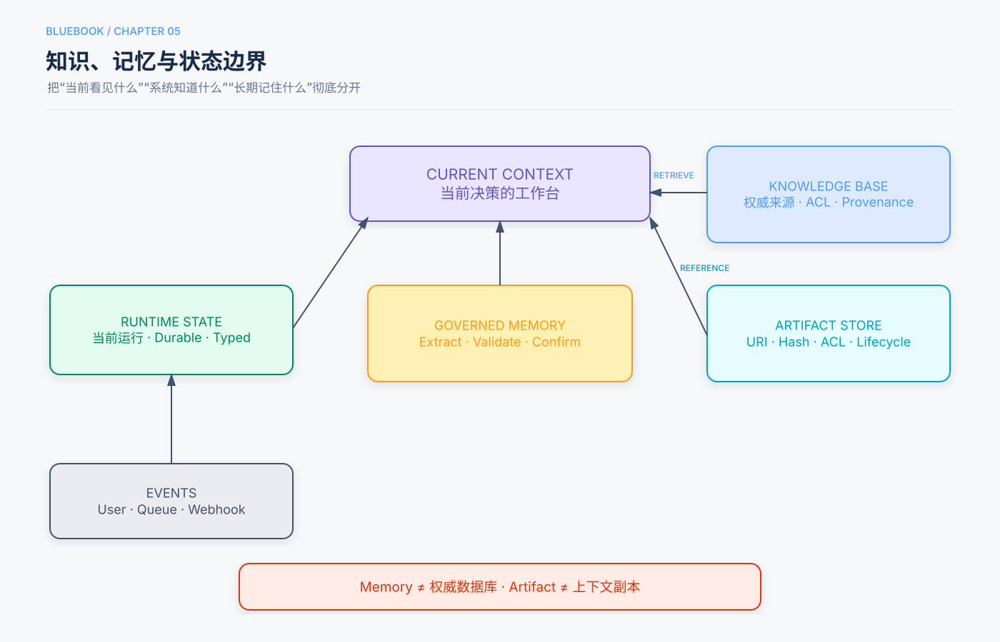

# 第5章　记忆、RAG与知识系统

> 状态：Release Candidate 1  
> 核心问题：如何让Agent在不把所有信息塞进上下文的前提下，使用跨会话偏好和外部权威知识。

## 本章回答的三个问题

1. Context、Memory、RAG和权威数据库分别保存什么？
2. 如何构建从检索、排序到引用的知识管道？
3. 如何避免记忆污染、事实过期和跨租户泄漏？

## 5分钟速读

- Context服务当前决策；Memory保存受治理的跨交互信息；RAG检索外部知识；权威业务事实应实时查询源系统。
- 不要保存所有对话。只保存未来有价值、可更新、可删除且来源明确的信息。
- 检索系统通常需要稀疏检索、向量检索、融合和Rerank，而不是只部署一个向量数据库。
- Agentic RAG只在查询需要迭代、换源或验证时使用；简单知识问答优先固定RAG流水线。
- 检索结果是外部输入，不是系统指令；必须保留来源、时间和信任等级。
- Memory更新应追加事实历史或使用显式版本，避免模型错误覆盖。
- 评估应分开看检索质量、回答质量、引用正确性、延迟、成本和隐私。

## 一、四类信息载体



| 信息 | 推荐载体 | 原因 |
|---|---|---|
| 当前步骤和预算 | Runtime State | 类型化、可恢复 |
| 用户稳定偏好 | Memory | 跨会话复用 |
| 政策和产品文档 | Knowledge Base / RAG | 可更新、可引用 |
| 余额、订单、库存 | 权威API/数据库 | 实时事实 |
| 长报告和代码 | Artifact Store | 避免重复装入上下文 |
| 行为规程 | Prompt / Skill / Harness | 按表达方式选择 |

## 二、Memory的渐进策略

### 2.1 会话摘要

保存一次会话的目标、决定和未完成事项。简单但可能丢失细节或引入摘要错误。

### 2.2 结构化用户事实

```yaml
fact: prefers_python_examples
value: true
source: user_explicit
observed_at: 2026-09-21
confidence: high
expires_at: null
```

事实需要来源、时间、置信度和删除策略。

### 2.3 事件日志与派生视图

把用户声明和已确认动作追加为事件，不直接覆盖旧事实；查询时根据时间和来源推导当前视图。这样可保留“曾住北京，后来搬到上海”的历史。

### 2.4 可执行策略

某些偏好可以编译为检查规则或代码，但必须与用户身份、版本和作用域绑定。可执行Memory仍需用户可查看、更正和删除。

## 三、RAG基础管道

```text
文档接入
→ 解析与分块
→ 元数据和权限
→ 稀疏/向量索引
→ 查询改写
→ 多路召回
→ 融合与Rerank
→ 上下文选择
→ 带引用生成
→ 引用与答案验证
```

### 稀疏与稠密检索

- BM25等稀疏检索擅长关键词、编号和专有名词；
- 向量检索擅长语义相似；
- 混合检索可覆盖两者，但需要融合和评估；
- Reranker在候选集上做更昂贵的相关性排序。

不要只用“答案看起来不错”评估RAG。应构建查询—相关文档标签，并测Recall、Precision、MRR或NDCG，再评答案引用和事实性。

## 四、结构化索引与上下文检索

长文档可以通过层次摘要、知识图谱或上下文化分块改善检索，但它们增加索引成本、更新复杂度和错误传播。选择前先判断：

- 文档是否有稳定结构；
- 查询是否需要跨段关系；
- 更新频率是否允许复杂重建；
- 简单混合检索是否已达到目标。

主仓库实验覆盖RAPTOR、GraphRAG、上下文检索和结构化知识抽取。相关百分比只能在对应数据、模型和实现条件下引用，不作为通用承诺。

## 五、Agentic与Corrective RAG

固定RAG适合一次检索即可回答的任务。Agentic RAG适合：

- 首次检索证据不足；
- 需要根据发现改写查询；
- 不同来源有冲突；
- 需要工具验证数字或事实；
- 需要决定何时停止检索。

最小循环：

```text
判断是否需要检索
→ 生成查询与来源范围
→ 检索
→ 评估证据充分性
→ 改写查询/换源/停止
→ 生成带引用答案
```

Corrective RAG的“自我纠正”必须落到可观察节点：相关性评分、来源质量、引用覆盖或外部验证，而不是模型笼统地“反思”。

## 六、权限、来源和污染

每个索引条目至少包含：

```yaml
document_id: policy-123
chunk_id: section-4
source_uri: internal://policies/refund-v7
owner_tenant: tenant-1
acl: [support-team]
valid_from: 2026-09-01
valid_to: null
content_hash: sha256:...
trust: authoritative_policy
```

检索必须在召回前执行租户和ACL过滤，不能先召回敏感内容再要求模型忽略。外部网页和用户上传文档标记为不可信数据，不得通过内容中的指令获得工具权限。

## 七、Memory写入流程

```text
候选事实抽取
→ PII和敏感等级分类
→ 来源与主体绑定
→ 与现有事实冲突检测
→ 必要时用户确认
→ 追加或版本化写入
→ 建立过期和删除索引
```

不应让生成回答的同一次模型调用直接、不经验证地更新长期Memory。

## 八、评估体系

| 层 | 指标 |
|---|---|
| Retrieval | Recall@K、MRR、NDCG、权限过滤 |
| Evidence | 来源质量、时效、冲突覆盖 |
| Answer | 正确性、引用支持、拒答 |
| Memory | 精确率、召回率、过期事实、错误个性化 |
| System | 延迟、成本、索引更新和可用性 |
| Safety | 越权检索、投毒、删除和租户隔离 |

主仓库第7章对用户Memory设计了分维Rubric和幻觉否决，可作为Memory评估示例，但具体分数不应外推。

## 九、常见失败模式

| 失败 | 控制 |
|---|---|
| 把账户事实存为Memory | 实时查询权威系统 |
| 摘要覆盖原始来源 | 保留事件日志和来源 |
| 向量相似但事实无关 | 混合检索和Rerank |
| 跨租户召回 | 检索前ACL过滤 |
| 旧政策仍被引用 | 有效期、版本和重建索引 |
| 文档指令劫持Agent | 数据/指令分离、工具授权 |
| Agentic RAG无限搜索 | 查询、轮数、成本和充分性终止 |

## 十、检查清单

- [ ] Context、Memory、RAG和权威系统边界明确。
- [ ] Memory有来源、版本、删除和过期。
- [ ] 检索在召回前执行权限过滤。
- [ ] 采用稀疏、稠密、融合和Rerank的依据来自评估。
- [ ] 引用可解析到原文和版本。
- [ ] Agentic RAG有预算和证据充分性终止。
- [ ] 外部内容不能提升权限。
- [ ] 生产失败回流检索和Memory评估集。

## 知识检查

1. 为什么订单状态不应作为普通Memory长期保存？
2. BM25和向量检索分别擅长什么？
3. Agentic RAG比固定RAG多出的控制是什么？
4. 为什么ACL过滤应在召回前执行？
5. Memory写入为何要与回答生成解耦？

## 来源与证据

主要来源为主仓库第3章及其用户记忆、混合检索、结构化索引和Agentic RAG实验；补充来源为Lesson 05、09、13和17。
