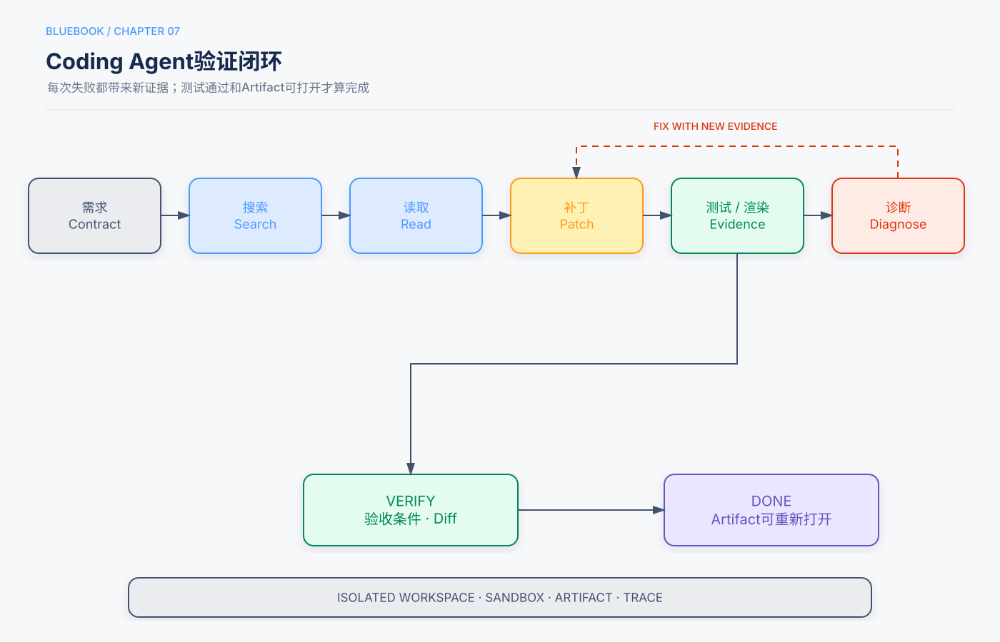

# 第7章　Coding Agent：通用Agent的工程母型

> 状态：Release Candidate 1  
> 核心观点：代码是可以创造新工具的元工具，Coding Agent展示了Agent最完整的观察—行动—验证闭环。

## 本章回答的三个问题

1. Coding Agent为什么比普通代码补全更接近通用Agent？
2. 搜索、编辑、执行、测试和修复如何组成可靠循环？
3. 如何安全地使用文件系统、Shell和代码执行器？

## 5分钟速读

- Coding Agent不是一次生成代码，而是在代码库和测试环境中持续观察、修改和验证。
- 文件系统既是工作环境，也是外部记忆和Artifact接口。
- 搜索应先于大范围读取，增量补丁应先于整文件重写。
- 测试、编译、Lint和渲染提供模型生成时没有的新信息，是循环改进的关键。
- “代码写完”不是完成；只有验收测试和目标环境状态通过才完成。
- Shell和代码解释器是高能力通用工具，必须运行在沙箱和最小权限环境。
- Proposer–Reviewer只有在Reviewer读取执行、测试或视觉证据时才可靠。
- 通用Agent可借鉴Coding Agent的工作区、Artifact、验证器和恢复机制。

## 一、从补全到Agent

代码补全根据局部上下文预测下一段代码；Coding Agent则执行完整任务：

```text
理解需求
→ 搜索代码库
→ 建立修改计划
→ 读取相关文件
→ 增量编辑
→ 运行测试/编译/Lint
→ 分析失败
→ 修复
→ 验证验收条件
→ 汇报变更与证据
```

下一步由代码和测试结果决定，因此它是典型的工具Agent。

## 二、观察空间

Coding Agent的观察包括：

- 用户需求和验收条件；
- 仓库结构；
- 搜索命中和相关代码；
- Git状态和差异；
- 编译、测试和Lint输出；
- 运行日志和性能数据；
- 页面截图或生成产物；
- 项目约定和AGENTS.md等说明。

高质量实现依赖“看对信息”，不是一次读完整仓库。应先目录和搜索，再按调用关系渐进读取。

## 三、动作空间

典型动作：

- 查找文件和符号；
- 读取文件；
- 精确编辑或应用补丁；
- 创建文件；
- 执行受限命令；
- 运行测试；
- 管理Git分支或Worktree；
- 生成文档、图表和其他Artifact。

动作越通用，安全边界越重要。任意Shell和文件写入不能默认访问宿主机全部目录、网络和凭据。

## 四、可靠开发循环



### 4.1 需求合同

在编辑前明确：

- 目标行为；
- 不应改变的行为；
- 影响文件和接口；
- 验收命令；
- 性能与安全限制。

### 4.2 搜索与局部理解

推荐顺序：

```text
目录 → 关键词/符号搜索 → 入口与调用者 → 测试 → 最小相关文件
```

避免先读取数百个文件导致上下文污染。

### 4.3 增量修改

优先精确补丁，保持现有风格和接口。大型改动分阶段，每阶段运行最小相关测试。

### 4.4 环境反馈

失败输出应结构化：命令、退出码、标准输出、标准错误、超时和Artifact。输出过长时保存为文件，在上下文中只放摘要和相关片段。

### 4.5 完成验证

完成至少需要：

- 目标测试通过；
- 相关回归测试通过；
- Git差异与任务范围一致；
- 没有意外生成文件或秘密；
- 用户要求的Artifact存在且可打开；
- 已知限制清楚。

## 五、文件系统作为工作记忆

建议工作区分层：

```text
/workspace/input      # 用户输入，只读或受控
/workspace/repo       # 代码工作副本
/workspace/scratch    # 临时分析和日志
/workspace/artifacts  # 用户可见交付物
/workspace/system     # 只读Skills和模板
```

长内容传路径和摘要，不反复复制到上下文。每个子Agent使用独立工作区，通过合并节点提交成果。

## 六、代码是元能力

代码不仅用于开发软件，还可动态创建：

- 数据清洗和统计工具；
- 图表与报告；
- 文档和演示文稿；
- API适配器；
- 约束求解器；
- 新的Agent工具和验证器。

这使Coding Agent成为通用Agent的重要基础。但动态生成的代码必须在受限环境运行，并经测试和审查后才能进入长期工具库。

## 七、Proposer–Reviewer

```text
Proposer生成候选
→ 执行/渲染候选
→ Reviewer读取测试或视觉证据
→ 输出结构化缺口
→ Proposer修复
→ 独立门禁决定结束
```

Reviewer应给出可定位的失败，例如测试名、截图区域、约束ID，而不是笼统评价“再美化一下”。循环有最大轮数和最小改进阈值。

## 八、并行与多Agent

适合并行：

- 独立模块；
- 不同测试或调研方向；
- 相互独立的文件集合。

不适合并行：

- 多个Agent编辑同一文件；
- 接口尚未冻结；
- 共享可变状态没有Owner。

使用Git Worktree或独立副本隔离，最终由一个Owner合并并运行完整测试。

## 九、安全边界

- 沙箱执行；
- 默认禁用宿主凭据和任意网络；
- 路径规范化，防止越界；
- CPU、内存、进程、时间和输出上限；
- 安装依赖需允许列表或审批；
- 删除、发布、部署和Push需要单独权限；
- 对生成Artifact扫描秘密和恶意内容；
- 外部仓库代码视为不可信。

## 十、常见失败模式

| 失败 | 控制 |
|---|---|
| 不搜索直接重写 | 先检索入口、调用者和测试 |
| 只写代码不运行测试 | 测试作为完成门禁 |
| 为通过测试修改测试 | 保护验收测试和审查Diff |
| 命令输出撑爆上下文 | Artifact化并提取相关片段 |
| 修改范围失控 | 需求合同、Diff预算 |
| 并行编辑冲突 | Worktree、文件Owner和合并节点 |
| 声称成功但产物打不开 | 重新打开、渲染或运行验证 |

## 十一、评估

- 任务通过率；
- 首次补丁接受率；
- 测试与回归；
- 无关文件修改；
- 工具调用和返工；
- 时间、Token和每成功任务成本；
- 安全违规；
- 失败恢复能力。

主仓库实验显示，不同模型可能采取不同的搜索和行动策略；在小规模实验中最终测试同样通过，并不能推出多读文件或更早编辑必然更好。

## 十二、检查清单

- [ ] 需求和验收命令明确。
- [ ] 搜索先于大规模读取。
- [ ] 编辑增量且Diff可审查。
- [ ] 执行环境隔离、限额和最小权限。
- [ ] 测试或渲染结果作为独立证据。
- [ ] 大型输出保存为Artifact。
- [ ] 并行任务有独立工作区和合并Owner。
- [ ] 发布、部署和Push需要额外授权。

## 知识检查

1. Coding Agent与代码补全的核心区别是什么？
2. 为什么测试结果构成“新信息”？
3. 文件系统如何同时承担环境和外部记忆？
4. Proposer–Reviewer何时会退化为无效自评？
5. 为什么通用Shell比专用工具需要更强控制？

## 来源与证据

主要来源为主仓库第5章及Coding Agent、PPT、视频、日志可视化等实验；补充库中代码作为工具和生产部署内容作为补充。
