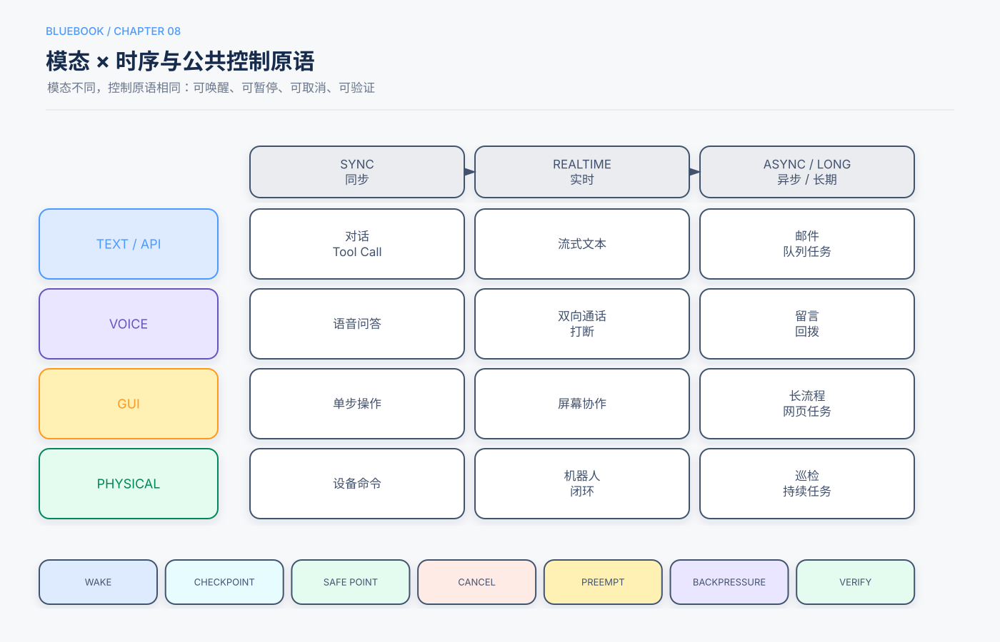

# 第8章　实时、异步与多模态交互

> 状态：Release Candidate 1  
> 核心问题：当Agent不再只处理同步文本，如何扩展观察、行动和时间模型而不失去控制。

## 本章回答的三个问题

1. 事件驱动、实时语音、Computer Use和机器人有哪些共同系统原语？
2. 如何处理等待、抢占、取消和慢任务？
3. 如何把多模态模型与确定性安全控制结合？

## 5分钟速读

- 交互扩展有两个维度：模态（文本、语音、视觉、物理）和时序（同步、实时、异步、长期）。
- 事件应持久化并绑定运行，不能只触发一个内存回调。
- 实时系统需要快慢路径分离：低延迟反馈与复杂推理不能相互阻塞。
- 取消、抢占和安全点是语音、GUI和机器人共享的控制原语。
- Computer Use应优先使用DOM或Accessibility信息，视觉截图作为补充；有API时优先API。
- 机器人必须由独立硬件安全控制器限制速度、空间和紧急停止，不能只依赖模型判断。
- 多模态输入同样可能包含提示注入和敏感信息。
- 最终完成由界面、后端或物理传感器状态验证，而不是由动作调用次数判断。

## 一、模态与时序矩阵



| 场景 | 同步 | 实时 | 异步/长期 |
|---|---|---|---|
| 文本/API | 对话、工具调用 | 流式文本 | 邮件、Webhook、队列任务 |
| 语音 | 语音问答 | 双向通话、打断 | 语音留言、回拨 |
| GUI | 单步浏览器操作 | 屏幕协作 | 长流程表单和后台网页任务 |
| 物理 | 单次设备命令 | 机器人闭环控制 | 巡检、定时和持续任务 |

## 二、异步与事件驱动

### 2.1 事件信封

```yaml
event_id: evt_123
type: email.received
source: support-inbox
occurred_at: 2026-09-21T10:00:00Z
tenant_id: tenant_1
correlation_id: case_789
payload_ref: artifact://events/evt_123.json
trust: external_untrusted
```

Runtime根据`correlation_id`找到等待运行，检查事件是否符合期待类型、是否重复或过期，再恢复状态机。

### 2.2 长任务

长任务不应把完整历史永久保存在一个上下文中。应保存：

- 已验证进展；
- 未完成事项；
- 最近失败；
- Artifact引用；
- 等待条件；
- 剩余预算。

恢复时构造新的决策上下文，而不是重放全部原始Token。

## 三、快慢路径分离

实时语音或协作界面需要低延迟响应，但复杂检索和工具任务可能耗时。可拆分：

```text
快路径：VAD、打断、确认、状态反馈、安全控制
慢路径：复杂推理、搜索、代码执行、长工具调用
```

快路径告诉用户“正在查询”并保持交互，慢路径异步完成后返回结果。两者共享运行状态，但使用不同延迟和预算目标。

## 四、实时语音

语音Agent通常包含：

```text
音频输入 → 语音活动检测 → 识别/原生音频模型
→ 对话与工具 → 语音生成 → 音频输出
```

关键控制：

- 用户打断时停止当前播报；
- 新话语可取消或更新旧计划；
- 识别低置信度时澄清姓名、数字和金额；
- 高影响动作通过文字或逐项复述确认；
- 录音、转写和声纹遵循隐私与保留政策；
- 工具慢调用不阻塞音频收发。

## 五、Computer Use

### 5.1 观察来源

优先组合：

1. DOM或结构化页面状态；
2. Accessibility Tree；
3. 截图和视觉模型；
4. 操作后的后端或页面验证。

完整元素树可能提高观察覆盖，也可能显著增加Token；应按任务裁剪并评估，而不是默认越完整越好。

### 5.2 Agent与Actor

- Agent决定目标、策略和异常处理；
- Actor只接受受限动作：点击已识别元素、输入允许字段、滚动、等待和截图；
- Policy Gateway拦截敏感域名、下载、剪贴板、密码和提交动作；
- Verifier检查真实完成状态。

### 5.3 提示注入

网页文字、图片和文档可能包含恶意指令。它们属于环境数据，不能覆盖系统策略。下载文件、打开链接或输入秘密需要额外政策。

## 六、机器人操作

机器人将动作空间延伸到物理环境，错误后果更大。分层控制：

```text
高层Agent：理解任务、规划子目标
技能控制器：抓取、移动、导航等受限技能
安全控制器：速度、力、区域、碰撞、急停
传感器验证：位置、接触、视觉和任务状态
```

模型不能绕过安全控制器。世界模型生成的未来画面是预测，不是物理正确性证明；需要短期闭环观察和不确定性处理。

## 七、共同控制原语

### 唤醒

事件、语音、定时器或其他系统触发运行。验证来源和幂等ID。

### 安全点

在不会留下半完成副作用的位置响应暂停或取消，例如文件写完、机械臂停稳或表单尚未提交。

### 取消

停止当前任务，清理资源，保存Checkpoint。取消应沿子任务级联。

### 抢占

高优先级事件暂停低优先级任务。需要保存可恢复状态和资源Owner。

### Backpressure

事件速度超过处理能力时，队列限流、合并重复事件、降低采样或拒绝低优先级任务。

## 八、完成验证

| 场景 | 弱证据 | 强证据 |
|---|---|---|
| 语音 | Agent说“已记录” | 后端工单ID与用户确认 |
| 浏览器 | 点击提交按钮 | 成功页面和后端状态 |
| 文件 | 调用write_file | 文件Hash、重新打开 |
| 机器人 | 发出抓取动作 | 传感器确认物体位置 |
| 异步任务 | Worker返回done | 目标Artifact和业务断言 |

## 九、常见失败模式

| 失败 | 控制 |
|---|---|
| 旧事件重复触发 | event_id去重和幂等 |
| 用户打断但工具继续写 | 取消传播和安全点 |
| 音频误识别金额 | 结构化复述和确认 |
| GUI点击后假成功 | 最终状态验证 |
| 页面注入诱导泄密 | 数据/指令分离和策略网关 |
| 机器人开放式动作 | 受限技能与硬件安全控制器 |
| 慢工具阻塞实时流 | 快慢路径和异步队列 |
| 长任务上下文膨胀 | 持久状态、Artifact和压缩 |

## 十、评估

- 端到端任务成功；
- 首次响应和打断延迟；
- 语音识别关键字段准确率；
- GUI动作成功和恢复率；
- 事件重复、丢失和过期；
- 取消响应时间；
- 机器人安全违规和急停；
- Token、带宽、工具成本和每成功任务成本。

不同模态需要不同环境评估，不能只用最终文本Judge。

## 十一、检查清单

- [ ] 明确模态和时序要求。
- [ ] 事件持久化、去重并绑定运行。
- [ ] 快慢路径分离。
- [ ] 取消、抢占和安全点由Runtime支持。
- [ ] Computer Use在API不可用时才启用。
- [ ] 多模态内容按不可信输入处理。
- [ ] 高影响语音和GUI动作经过确认。
- [ ] 机器人有独立硬安全控制器。
- [ ] 最终状态由环境验证。

## 知识检查

1. 为什么实时系统需要快慢路径？
2. 事件信封为什么需要`event_id`和`correlation_id`？
3. Computer Use中结构化页面信息和截图如何取舍？
4. 用户打断后，为什么不仅要停止语音输出？
5. 世界模型预测为什么不能替代机器人安全控制？

## 来源与证据

主要来源为主仓库第6章及语音、Computer Use、机器人和异步实验；补充来源为Lesson 15和16。具体模型、设备和基准结果留在实验册，不外推为通用性能承诺。
